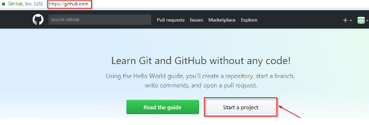
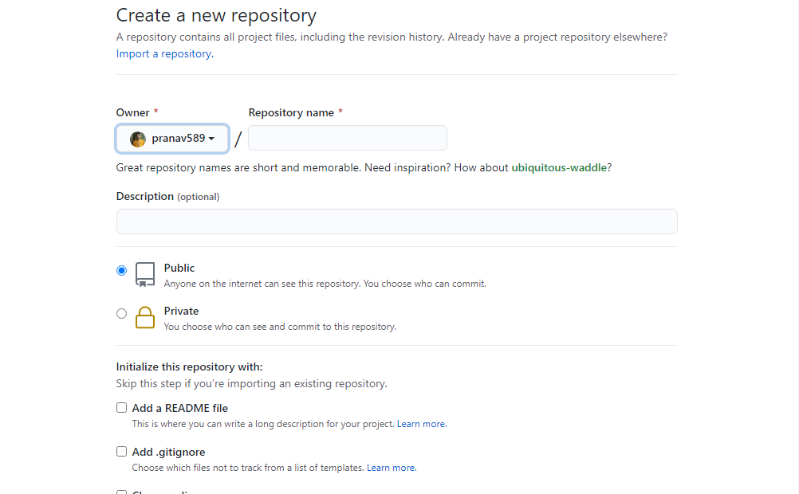

Hello everyone, I hope all are doing great.This is my first ever blog and I am damn excited for this.

I'm sure I'll write a lot more interesting things in the future.

Today we are going to learn about GITHUB. What is github,how to use it and all such questions will be answered. So read the blog till the end and lets get started.


## Step-01: What is Github?

  To be very precise about what exactly is GitHub, it is a file or code-sharing service to collaborate with different people. 
  
  Github is a highly demanded and highly used version control system. It is very helpful for the projects which have more than one contributor. By using github more than one peroson can work on the same project simultaneously. Sounds cool right?


## Step-02: How to make a github repository?

1. First and the most basic thing that you require for using github is an account on github. So head over to [Github](https://www.github.com) and create your account there which is quite straight forward. And install git on your local machine. Your can refer git docs for the installation which is quite easy as well.

2. Then click on start new project.



3. Fill your repository name, description(optional) and then click on create repository.And your repositoy is generated. Congratulations.

It also has a PUBLIC , PRIVATE options which by default is PUBLIC that means everyone can see our code which is called "open source". 

4. Now there are certain commands given by git that can be used for specific operations.For instance, fo pushing our code to github, we have a specific command or for pulling the code on our local machine from github , we have a separate command. We are going to learn all those commands one by one.

All these commands should be made using your local terminal or the terminal provided by your code editor.

#####  git init
```js
git init
```
This command initalizes a  .git file for your local project.

#####  git add
```js
git add .
```
This command is used to add our local file changes to our git initiliazed file. The dot(.) at the end indicates that all the files should be added. You can type individual names of the files as well.


#####  git commit
```js
git commit -m 'commit description'
```
This command is used for making commits and the commit should have a meaningful description.

#####  git remote add origin 
```js
git remote add origin https://github.com/pranav589/example.git
```
This command adds the code to the remote server.

##### git push -u origin main 
```js
git push -u origin master
```
This command is used to push your code from your local machine to github.Refresh the page and you can see your code.


##### git pull 
```js
git pull <remote>
```
The git pull command is used to fetch and download content from a remote repository and immediately update the local repository to match that content.

##### git clone 
```js
git clone <remote>
```
git clone  is used to target an existing repository and create a clone, or copy of the target repository.

##### git branch 
```js
git branch <name>
```
git branch command is used for creating a branch of an existing project so that different people can work on the same project simultaneously.


There are few more commands that can used to perform certain operations. But all these commands that we learnt today are the most basic but important commands.

Thank you for reading!!


